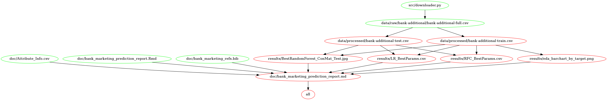

# Bank Marketing Prediction

  - Contributors: Melisa Maidana, Steven Lio, Zheren Xu
	
Group data analysis project for DSCI 522 (Data Science Workflows); 
A course in the 2021 Master of Data Science program at the University of 
British Columbia.

## About

Telemarketing campaigns can be very expensive to institutions. 
The possibility to predict the likelihood of customer response can lead to more efficient strategies that reduce implementation costs and maximize the success rate.

The objective of this project is to identify which customers are more likely 
to respond positively to a telemarketing campaign and subscribe to a new product (a long-term deposit). 
Specifically, if a customer is contacted over the phone, will they subscribe to the new product being offered? 

To address the predictive question posed above, we conducted an exploratory data analysis 
and built a machine learning model to predict if a certain customer would subscribe to the new product.

Our final classifier was a Logistic Regression model that achieved an F1 score of 59.7% and a recall of 90%. 
The features identified as more important were related to the duration of the call, the month of contact, 
the past reaction of the customer to previous calls, and the Consumer Price Index.
We believe that some additional features, such as the reason for the last contact, could bring additional value to the model
and help to improve its precision and False Positive rate.

## Data

The data set used in this project is related to direct marketing campaigns (phone calls) of a Portuguese banking institution [@moro2014data] can be found [here](http://archive.ics.uci.edu/ml/machine-learning-databases/00222/bank-additional.zip).

## Report

The final report can be found [here](https://htmlpreview.github.io/?https://github.com/UBC-MDS/Bank_Marketing_Prediction/blob/main/doc/bank_marketing_prediction_report.html)

## Usage

To replicate the analysis, all relevant data, scripts and necessary dependencies are available in this
GitHub repository. 
Please run the following commands at the command line/terminal from the root directory of
this project after cloning the GitHub repository locally.

    # Download Banking dataset from source unzip and save it to data/raw:
    python src/downloader.py http://archive.ics.uci.edu/ml/machine-learning-databases/00222/bank-additional.zip --path=data/raw
	
    # Run preprocessor script (will create a 80%/20% train/test split):
    python src/data_preprocessing.py data/raw/bank-additional/bank-additional-full.csv data/processed --test_split=0.2

    # Generate EDA tables and figures:
    python src/eda.py data/processed/bank-additional-train.csv results

    # Build model (Dummy Classifier, Random Forest, Logistic Regression):
    python src/Build_Models.py data/processed/bank-additional-test.csv data/processed/bank-additional-train.csv results

    # Render the final report in Rmarkdown and html file
    Rscript -e "rmarkdown::render('doc/bank_marketing_prediction_report.Rmd')"

Or

After cloning this GitHub repository and install all necessary dependencies listed below, run the following command in the 
command prompt/terminal from the root directory of this project to replicate the full analysis and final report:

    `make all`

To reset the repo to the original state and delete all results files and report, run the following command at the command
prompt/terminal from the root directory of this project:

    `make clean`

## Dependencies
	
	- Python 3.9.0 and Python packages:
		- docopt==0.6.2
		- ipykernel
		- requests>=2.25.1
		- matplotlib>=3.4.2
		- pandas>=1.3.*
		- scikit-learn>=1.0
		- altair>=4.1.0
		- seaborn>=0.11.2
		- errno
		- zipfile
		- altair_saver>=0.5
		- vega-lite vega-cli canvas
	- R version 3.6.1 and R packages:
		- knitr=1.33
		- tidyverse=1.3.1
		- ggplot2=3.3.5
		- kableExtra=1.3.4

## License

The data set used in this Banking Marketing Prediction project is released by UCI. 
Detail of this dataset can be found [here](http://archive.ics.uci.edu/ml/datasets/Bank+Marketing). 

The Banking Marketing Prediction materials (excluding original data set) here are licensed
under the MIT License found [here](https://github.com/UBC-MDS/Bank_Marketing_Prediction/blob/main/LICENSE).

## References

This dataset is public available for research. The details are described in [@moro2014data](http://archive.ics.uci.edu/ml/machine-learning-databases/00222/bank-additional.zip).

