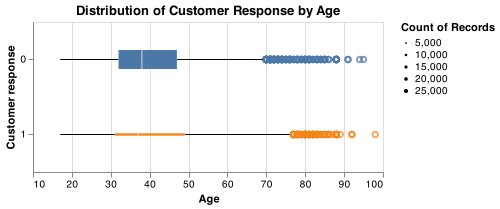

```{r setup, include=FALSE}
knitr::opts_chunk$set(echo = FALSE)
library(tidyverse)
library(knitr)
```

## Introduction

Telemarketing campaigns can be very expensive to institutions. 
The possibility to predict the likelihood of customer response can lead to more efficient strategies, 
that reduce implementation costs and maximize the success rate.

The objective of this project is to identify which customers are more likely 
to respond positively to a telemarketing campaign and subscribe to a new product (a long-term deposit). 
To address the predictive question posed above, we plan to conduct an exploratory data analysis 
to identify the best features that can help predict the customer response. 
Our objective is to build a machine learning model that can predict if a certain customer 
looks alike the target audience for this product.

## Methods

### Data

The data set used in this project is related with direct marketing campaigns (phone calls) of a Portuguese banking institution [@moro2014data] can be found [here](http://archive.ics.uci.edu/ml/machine-learning-databases/00222/bank-additional.zip).

The data set contains 20 features, plus the desired target. 
Each row represents information of one client, including personal and banking attributes, 
and information related to the past interactions with the telemarketer.

The data set presents class imbalance, since only about 11% of the records are targeted as positive
(meaning that the customer responded to the telemarketing offer).

```{r load_eda_table, echo=FALSE, include = FALSE}
summary <- read_csv("../results/eda_summary_table.csv")
summary <- summary |>  # remove first column (index)
    select(-1) 
```

```{r eda_class_imbalance, echo=FALSE}
knitr::kable(summary, 
      caption = "Table 1. Summary of examples per customer response in the dataset. Class imbalance is observed. ")
```

```{r eda_boxplot, echo=FALSE, fig.cap="Figure 1. Distribution of customer response per age.", out.width = '60%'}

```

### Analysis

## Results & Discussion

# References
