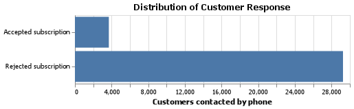
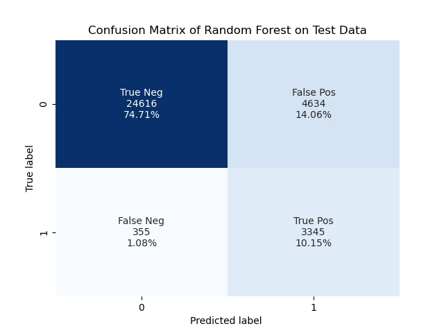
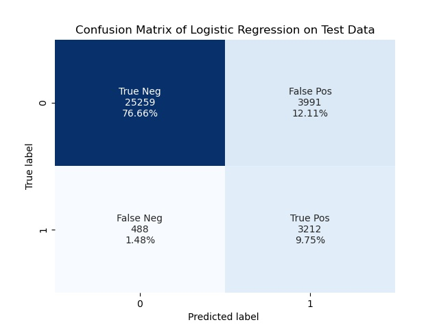

```{r setup, include=FALSE}
knitr::opts_chunk$set(echo = FALSE)
library(tidyverse)
library(knitr)
library(kableExtra)
```

## Introduction

Telemarketing campaigns can be very expensive to institutions. The
possibility to predict the likelihood of customer response to a campaign
can lead to more efficient strategies that reduce implementation costs
and maximize the success rate.

There are two main objectives of this project, first is to develop a
predictive model which can be used to identify which customers are more
likely to respond positively to a telemarketing campaign and subscribe
to a new product (a long-term deposit) if contacted by the bank over the
phone.

Second is to explore what can we learn from the predictive model to
understand the types of customers the bank should prioritize on contact
and what are the limitation of the information in the data sets.

## Data

The data set used in this project is related to direct marketing
campaigns (phone calls) of a Portuguese banking institution
[@moro2014data] can be found
[here](http://archive.ics.uci.edu/ml/machine-learning-databases/00222/bank-additional.zip).

The data set contains 20 features, plus the desired target. Each row
contains information of one client, including personal and banking
attributes, and data related to the past interactions with the
telemarketer.

```{r Load_attr, echo=FALSE, include=FALSE}
attrs <- read_csv("../doc/Attribute_Info.csv")
```

```{r attr, echo=FALSE}
attrs %>%
  kbl(caption = "Table 1. Attribute from Banking Data.") %>%
  kable_classic(full_width = F, html_font = "Cambria")
```

The data set presents class imbalance. We will assess during
hyper-parameter tuning if balancing the class leads to better model.

```{r eda_barchart, fig.align = 'center', echo=FALSE, fig.cap="Figure 1. Class imbalance is observed in the target class. Only 11% of customers reached by the telermarketing campaign accepted the subscription to a new product.", out.width = '60%'}

```

## Model building and selection

Model building process has been carried out in Python 3.9 with the
[`scikit-learn`](https://scikit-learn.org/stable/) library. Two models,
Random Forest Classifier and Logistic Regression, have been trained
under the following conditions:

-   5-fold
    [cross-validation](https://en.wikipedia.org/wiki/Cross-validation_(statistics))
    results were used for model evaluation

-   Accuracy, f1-score, recall rate, and precision were the metrics
    selected for model evaluation.

-   Preprocessing of training data:

    -   Data was randomized and split based on 80% for training and 20%
        for testing.
    -   All features can be classified into categorical or numeric
        features. No features were dropped.
    -   Missing numeric values are filled using the median. Missing
        values in categorical features are filled as "missing".
    -   All numeric features are scaled using the mean and variance
        (Standardization)
    -   All categorical features are transformed with One-Hot Encoding.

-   Parameters and hyper-parameters tuning.

    -   To speed up the training process and ensure reproducibility, the
        value of `n_jobs` is set to `-1` and `random_state` to `123`.
    -   The hyper-parameters are tuned by `RandomizedSearchCV` and the
        optimal parameter values are chosen based on the f1-score since
        it provides balance between recall and precision at the same
        time.
    -   The baseline accuracy of the model is 88.8% (obtained from the
        Dummy Classifier using the highest frequency).

### Random Forest Classifier

The best hyper-parameters for the Random Forest are:

```{r Load_RFC_params, echo=FALSE, include=FALSE}
RFC_BestParams <- read_csv("../results/RFC_BestParams.csv")
RFC_BestParams <- RFC_BestParams %>% select(-1) 
```

```{r RFC_params, echo=FALSE}
RFC_BestParams %>%
  kbl(caption = "Table 2. Best hyper-parameters for Random Forest Classifier.") %>%
  kable_classic(full_width = F, html_font = "Cambria")
```

```{r conmat_RFC, echo=FALSE, fig.align = 'center', fig.cap="Figure 2. Confusion matrix for Random Forest Classifier on Test data", out.width = '60%'}

```

```{r RFC_scores, echo=FALSE}
tibble(Accuracy="82.9%",
       Precision="39.7%",
       Recall="96.4%",
       f1="56.2%") %>%
  kbl(caption = "Table 3. Best Random Forest Classifier model scores on validation set:") %>%
  kable_classic(full_width = F, html_font = "Cambria")
```

Random Forest Classifiers trained with the best parameters from
hyper-parameter optimization give relatively decent scores on the
prediction on validation data. Even though precision is low, it achieved
an excellent recall score.

### Logistic Regression

```{r Load_LR_params, echo=FALSE, include=FALSE}
LR_BestParams <- read_csv("../results/LR_BestParams.csv")
LR_BestParams <- LR_BestParams %>% select(-1) 
```

```{r LR_params, echo=FALSE}
LR_BestParams %>%
  kbl(caption = "Table 4. Best hyper-parameters for Logistic Regression Classifier.") %>%
  kable_classic(full_width = F, html_font = "Cambria")
```

```{r conmat_LR, echo=FALSE, fig.align = 'center', fig.cap="Figure 3. Confusion matrix for Logistic Regression on Test data", out.width = '60%'}

```

```{r LR_scores, echo=FALSE}
tibble(Accuracy="86.1%",
       Precision="44.6%",
       Recall="90.3%",
       f1="59.7%") %>%
  kbl(caption = "Table 5. Best Logistic Regression Classifier model scores on validation set:") %>%
  kable_classic(full_width = F, html_font = "Cambria")
```

Logistic Regression overall performs better than the Random Forest
Classifier.

From the results above, we conclude that the Logistic Regression model
will be the best for predicting customer response to the telemarketing
campaign. In addition, it provides more interpretable results through
the features coefficients.

## Analysis and Results Discussion

```{r load_coef_table, echo=FALSE, include = FALSE}
lr_coeff <- read_csv("../results/BestLogisticRegression_Coefficients.csv") %>% arrange(desc(Coefficient))
colnames(lr_coeff) <- c("Feature","Coefficient")
lr_coeff
```

```{r coeff_barplot, echo=FALSE, fig.align = 'center', fig.cap="Figure 4. Top 10 Coefficients from Logistics Regression Model", out.width = '60%'}
ggplot(lr_coeff[1:10,], aes(x=Coefficient, y=reorder(Feature, Coefficient), fill=Coefficient)) +
  geom_bar(stat="identity", show.legend = FALSE) +
  geom_text(aes(label=round(Coefficient,2)), hjust = 1.3, color="white", size=5.0) +
  theme_classic() +
  labs(x="Coefficient Values",
       y="Features",
       title="Top 10 Coefficients") +
  theme(plot.title=element_text(hjust=0.5, face="bold"),
        axis.title.x=element_text(face="bold"),
        axis.title.y=element_text(face="bold"))
```

As shown in Figure 4, `duration` and `month_mar` have the highest
coefficient value in the final model. `duration` corresponds to the
duration of the call in seconds and `month_mar` corresponds to the
customer whose last contact date occurred during March. We can also see
that the campaign achieved better response rates in August and October.

`poutcome_success` indicates previous success with marketing campaign
and is tied to the idea that a customer that accepted a telemarketing
offer in the past may be more likely to accept a new one again.

Finally another interesting feature is `cons.price.idx`, which shows up
as the 3rd more important variable learned by the model. The Consumer
Price Index is a quarterly updated variable that indicates the changes
in prices as experienced by consumers. When this index is high, then
customers may be more open to switching to a new product for a better
price. Even though this may lower the revenue per customer, it still may
be a desired objective for other reasons, such as customer retention.

```{r bot_coeff_barplot, echo=FALSE, fig.align = 'center', fig.cap="Figure 4. Top 10 Coefficients from Logistics Regression Model", out.width = '60%'}
ggplot(lr_coeff[(nrow(lr_coeff)-10):nrow(lr_coeff),], aes(x=Coefficient, y=reorder(Feature, Coefficient), fill=Coefficient)) +
  geom_bar(stat="identity", show.legend = FALSE) +
  geom_text(aes(label=round(Coefficient,2)), hjust = -0.1, color="white", size=5.0) +
  theme_classic() +
  labs(x="Coefficient Values",
       y="Features",
       title="Bottom 10 Coefficients") +
  theme(plot.title=element_text(hjust=0.5, face="bold"),
        axis.title.x=element_text(face="bold"),
        axis.title.y=element_text(face="bold"))
```

It is also noted the most negative coefficient from the Logistic
Regression also tells us that what features tends to associate with
lowering the probability of a customer's likelihood of subscribing to
the new product over telemarketing. We can see that `emp.var.rate`
(employment variation rate) is the negatively impact the probability of
a customer will subscribe. A lower employment variation rate indicates
the employment market of the economy (quarterly metric) hence when job
market is weak, customer are also hesitant on trying new products or
spending money in general. We also see that avoid mass telemarketing
campaign during May and December as it has the worst response rate.

One thing also obvious is that try not to contact those who rejected
previous campaign offers (`poutcome_failure`) and only if they are worth
going after (i.e. if we can find out they carry good customer value and
may have the criteria to be offered the new product such as income
level, investments, credit score, tenure etc.)

### Limitations

Even though there seems to be a better success rate on certain months,
we lack of context on the campaign schedule and other environment
variables, so at this point we cannot make any inferences regarding
those features.

Also, we believe that capturing additional features in the data
gathering process, such as the reason of last contact, would add
valuable information and increase the accuracy of the model.

Lastly, we want to note that the model has been trained with bank
customers information that were contacted at least once by the
telemarketing agency. As a consequence, it cannot be used to predict the
response of new customers.

### Conclusions

Overall the model has stable accuracy and recall rate. Hence, with the
correct variables, the model can identify those who will be likely to
respond to the telemarketing campaign. Some additional features, such as
the reason for the last contact, could bring additional value to the
model and improve the False Positive rate.

The model developed provides flexibility to prioritize the customers by
likelihood of success until we reach a desired target or budget.
Although, we also recommend assigning weight to the customers based on
their banking/personal profile. This categorization should be defined by
the bank and must be aligned with the objective of the particular
campaign.

## References
